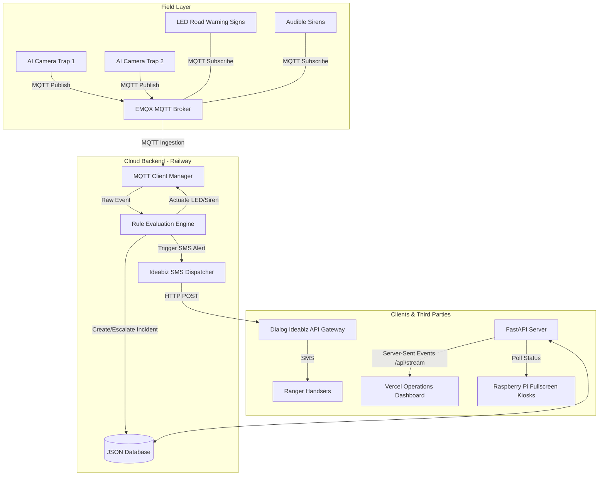

# Dialog Smart Alerts — System Documentation

This document provides a comprehensive overview of the **Dialog Smart Alerts** platform, detailing its architecture, technology stack, use cases, core modules, API specifications, and external integrations.

---

## 1. System Architecture

The platform uses a decoupled, event-driven architecture designed for real-time processing and low-latency alerts.



---

## 2. Technology Stack

### Backend Services ( Railway )
*   **Language**: Python 3.10+
*   **Framework**: FastAPI (high-performance ASGI web framework)
*   **ASGI Server**: Uvicorn (lightweight production server)
*   **MQTT Client**: `paho-mqtt` (sub-second telemetry ingestion and actuation)
*   **Database**: JSON Document Store (`data_store.py`) backed by persistent local files for config (stakeholders, zones, rules) and runtime telemetry (incidents, events).
*   **SMS Client**: Asynchronous thread pool wrapper using Python's native `urllib.request`.

### Frontend Applications ( Vercel )
*   **Framework**: React (built using Vite)
*   **Styling**: Vanilla CSS (sleek dark mode layout with custom emergency pulse animations)
*   **Icons**: Lucide React
*   **Maps**: Leaflet (interactive spatial engine rendering animal detections on topographical maps)
*   **Real-time sync**: Server-Sent Events (SSE) `EventSource` for instant browser telemetry.

---

## 3. Core System Use Cases

### Use Case 1: Human-Elephant Conflict Mitigation (Yala Road Corridor)
*   **Goal**: Prevent vehicular collisions with elephants crossing roads in Yala National Park.
*   **Trigger**: A camera trap detects an elephant near the road corridor with a confidence of $\ge 60\%$.
*   **Action**: 
    1. A **High** severity incident is opened.
    2. Nearby LED warning signs are activated to **AMBER** to warn drivers.
    3. Wildlife Officers and the DWC Operations Centre receive a **High** alert SMS.
    4. Nearby fullscreen kiosk displays immediately turn **RED** with warning instructions and the custom elephant image.

### Use Case 2: Multi-Station Confirmation (Critical Escalation)
*   **Goal**: Escalate security warnings when multiple sightings confirm active movement.
*   **Trigger**: A second elephant detection occurs within the same zone within 15 minutes.
*   **Action**:
    1. The incident is escalated to **Critical**.
    2. Warning signs turn **RED** and sirens sound.
    3. Emergency SMS dispatches are sent to all rescue units (Police, Traffic Control, and Park Wardens).

---

## 4. Core Software Modules

All source files are located in the `backend/` directory:

### `server.py`
The primary application entry point. Handles:
*   REST API endpoints (CRUD operations for devices, stakeholders, incidents, and rules).
*   HTTP server initialization and port binding.
*   The `/api/stream` Server-Sent Events (SSE) broadcaster, pushing database mutations to connected web browsers in real-time.

### `rule_engine.py`
The decision-making hub of the system. Evaluates incoming events against registered rules, checks for confirmation thresholds (number of detections in a time window), and returns the matched rule and action triggers.

### `mqtt_client.py`
Manages the background telemetry thread:
*   Establishes a persistent connection to the EMQX public broker (`broker.emqx.io`).
*   Listens to `dialog/detections` and parses incoming camera telemetry.
*   Publishes actuation commands to topic `dialog/actuators/...` to change warning sign lights and sound sirens.

### `notifier.py`
The notification engine. When triggered by the rule engine, it:
*   Renders stakeholder message templates using the incident context.
*   Normalizes recipient phone numbers into the standard `tel:+94...` MSISDN format.
*   Sends HTTP POST requests to the **Ideabiz SMS API**.
*   Applies a **Sandbox Formatter Polyfill** if the message violates Sandbox limitations (i.e. if it exceeds 60 characters or lacks the phrase `"test message"`), ensuring successful test dispatches.

---

## 5. REST API Specifications

| Method | Endpoint | Description |
|---|---|---|
| **GET** | `/api/incidents` | Lists all active and resolved incidents |
| **POST** | `/api/incidents/{id}/resolve` | Resolves an active incident, restoring sign states and kiosk screens back to clear |
| **GET** | `/api/kiosks` | Lists all configured kiosk devices |
| **GET** | `/api/kiosks/{device_id}/status` | Checked by kiosks to determine if their assigned sector is in `ALERT` or `CLEAR` state |
| **GET** | `/api/system/health` | Diagnostics endpoint tracking broker connection, active incidents, and database states |

---

## 6. Integration Contract (For External AI/Camera Teams)

To connect any external AI model or camera system to the alert network, program the device to publish telemetry messages to:

*   **Broker Host**: `broker.emqx.io:1883`
*   **Topic**: `dialog/detections`
*   **JSON Format**:
    ```json
    {
      "station_id": "st_01",
      "entity_id": "cam_04",
      "alert": "elephant",
      "value": 0.94,
      "timestamp": "2026-07-13T06:17:46Z"
    }
    ```

---

## 7. Ideabiz SMS Configuration

To change the Ideabiz gateway credentials, update the environment variables in the **Railway Variables Dashboard**:

*   **`IDEABIZ_API_URL`**: `https://ideabiz.lk/apicall/smsmessaging/v3/outbound/87798/requests`
*   **`IDEABIZ_TOKEN`**: your OAuth access token.
*   **`IDEABIZ_SENDER_PORT`**: `tel:87798`
*   **`IDEABIZ_SENDER_NAME`**: `smartalerts`
